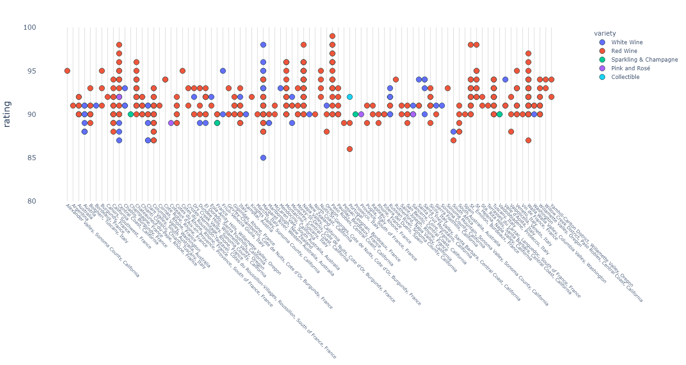
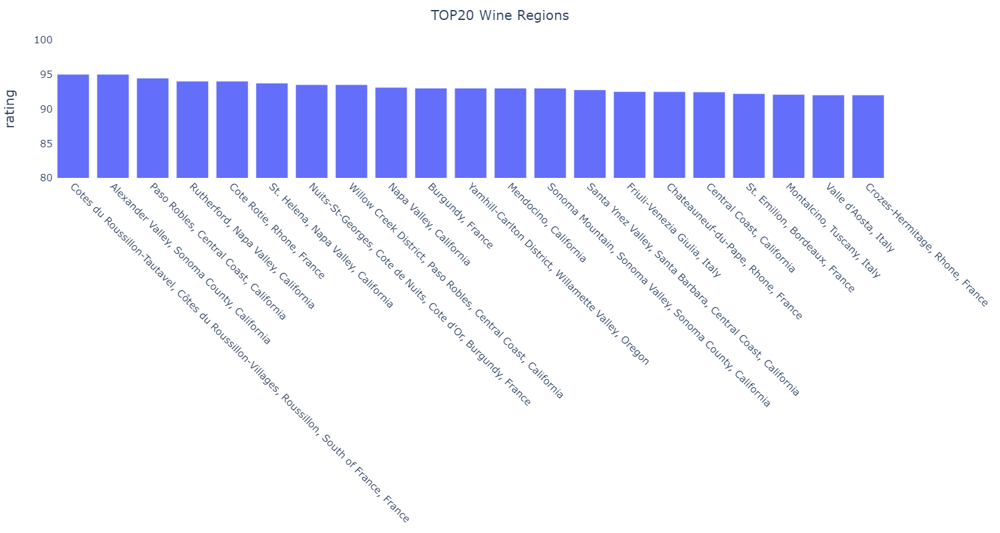

# Mapping Data in Python
Based on Coursera Lesson 2: Mapping Data to Python

[Python, Bash and SQL Essentials for Data Engineering Specialization](https://www.coursera.org/specializations/python-bash-sql-data-engineering-duke) 

# Analysis of wine ratings database
The jupiter notebook analyze_data loads the wine data from a json file and converts it to a pandas dataframe. Two example plots are created with the plotly express library. To get an interactive version of the plots, open the .html files in this folder.

### 
